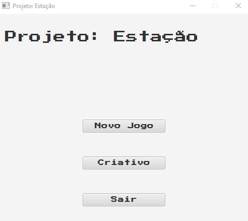
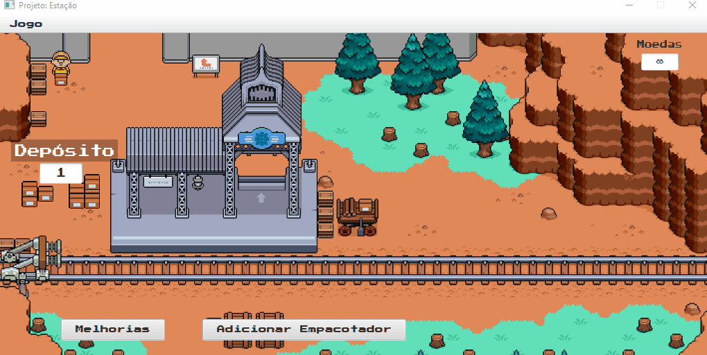

# Estação de entrega

 Projeto criado para a cadeira de Sistemas Operacionais, aplicando o conceito de processos multi-threads e concorrência.
 
 ## Equipe
 Francisco Jorge Monteiro Júnior
 João Augusto de Oliveira Sousa
 Raphael Cabral de Oliveira Figueiredo

 ## Tecnologias Utilizadas

 - [Java](https://www.java.com/pt-BR/)
 - [JavaFX](https://openjfx.io/)

 ## Demonstração da Aplicação

  ### Navegação nos menus iniciais
  

  ### Execução do Jogo
  

